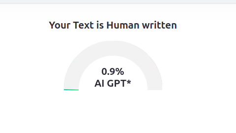
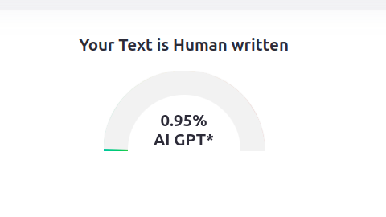
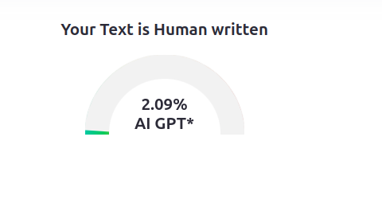
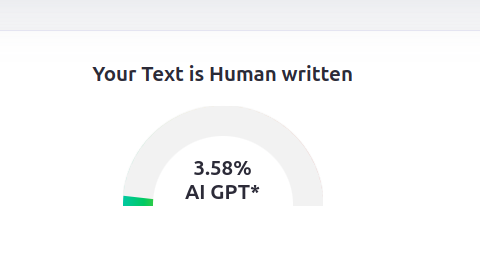
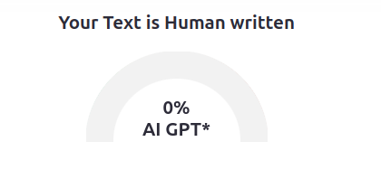
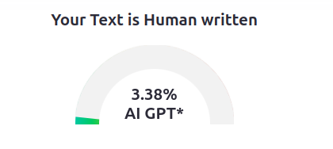

# humanized-blog-gen

# Humanized Blog Generator

A JavaScript application that uses Google's Gemini AI to generate human-like blog posts that are designed to appear natural and score low on AI detection tools like ZeroGPT.

## Features

- Generate blog posts between 300-500 words on any topic
- Choose from multiple tones (casual, professional, humorous, reflective, informative)
- AI-generated content is optimized to appear human-written
- Built-in word counter
- Copy-to-clipboard functionality
- Mobile-responsive design

## Prerequisites

- Node.js (v14 or higher)
- Google Gemini API key (https://ai.google.dev/)

## Installation

1. Clone this repository
2. Install dependencies:
   ```
   npm install
   ```
3. Set up your environment variables:
   - Copy `.env.example` to `.env`
   - Add your Gemini API key to the `.env` file:
     ```
     GEMINI_API_KEY=your_gemini_api_key_here
     PORT=3000
     ```

## Usage

1. Start the application:
   ```
   npm start
   ```
2. Open your browser and navigate to `http://localhost:3000`
3. Enter a blog topic and select a tone
4. Click "Generate Blog" to create your humanized content

## How It Works

The application uses carefully engineered prompts and parameters with the Gemini AI model to generate content that mimics human writing patterns. Key strategies include:

- Natural language variations with different sentence structures
- Strategic use of first-person references and personal anecdotes
- Inclusion of conversational elements and filler words
- Deliberate incorporation of subtle imperfections in writing style
- Additional frontend humanization with random typos and stylistic elements

The frontend adds another layer of humanization by randomly introducing:
- Subtle "typos" that appear to be corrected
- Emphasis using italics
- Conversational punctuation (ellipses, em dashes)

## License

MIT


## Testing
 
 
 
 
 
 